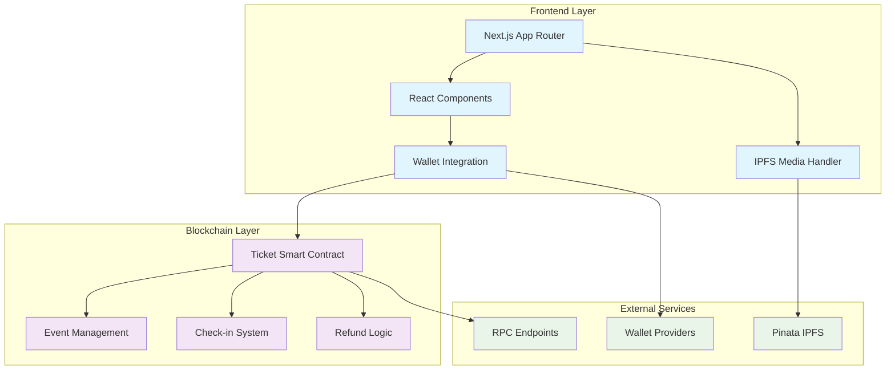
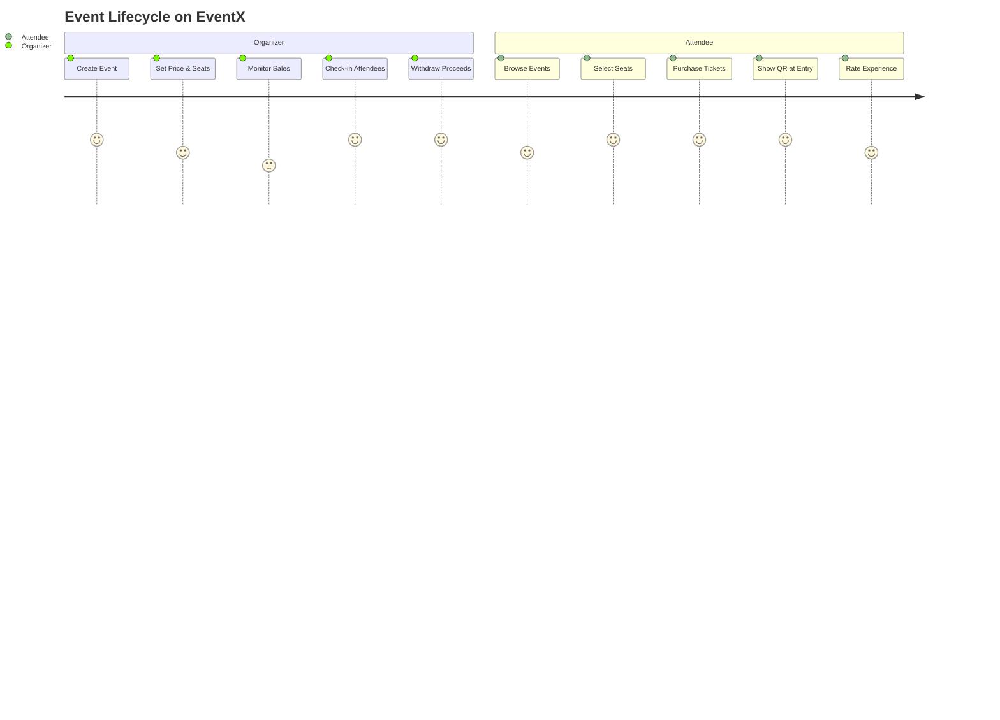

# 🎫 EventX — Transparent Web3 Ticketing Platform

# contract address -— 0x6937de2Cd1Ad91C4EB7e86AC22ad92c5B89d678B


<div align="center">


**The future of event ticketing is here — transparent, fraud-proof, and fair.**

[](https://choosealicense.com/licenses/mit/)
[](https://nextjs.org/)
[](https://soliditylang.org/)
[](https://www.typescriptlang.org/)

[🚀 Live Demo] • [🚀 Live Link](https://event-xd.vercel.app/) • [🐛 Report Bug](../../issues) • [💡 Request Feature](../../issues)

</div>

---


## 🌟 Overview

EventX revolutionizes event ticketing by putting tickets on the blockchain. Say goodbye to fraud, scalping, and unfair practices. Our platform ensures transparent pricing, instant transfers, and verifiable ownership for both organizers and attendees.

### ✨ Key Features

🔒 **Fraud-Proof Tickets** — Every ticket is a unique blockchain asset  
💰 **Fair Resale Caps** — Prevent scalping with built-in price limits  
⚡ **Instant Check-in** — QR code verification in milliseconds  
🔄 **Automatic Refunds** — Smart contract enforced refund policies  
🎨 **Modern UI/UX** — Clean, accessible design with smooth animations  
📱 **Mobile-First** — Optimized for all devices and screen sizes

---

## 🏗️ Architecture



---

## 🚀 Quick Start

### Prerequisites

- **Node.js** 18+ 
- **npm** (recommended) or pnpm
- **MetaMask** or compatible Web3 wallet

### Installation

```bash
# Clone the repository
git clone https://github.com/web3baddies/EventX.git
cd EventX

# Install dependencies
cd fe
pnpm install

# Set up environment variables
cp .env.example .env.local
# Edit .env.local with your configuration

# Start development server
npm dev
```

Visit [http://localhost:3000](http://localhost:3000) to see the app running! 🎉

---

## 📋 Environment Setup

Create `fe/.env.local`:

```env
# Network Configuration
NEXT_PUBLIC_CHAIN_ID=51
NEXT_PUBLIC_TICKET_ADDRESS=0x6937de2Cd1Ad91C4EB7e86AC22ad92c5B89d678B
NEXT_PUBLIC_RPC_URL=https://erpc.apothem.network


# IPFS Configuration (Server-side only)
PINATA_JWT=your_pinata_jwt_token_here
```

> ⚠️ **Important**: Never commit real API keys to version control!

---

## 🎯 User Journey



---

## 🏠 Project Structure

```
EventX/
├── fe/                          # Frontend Next.js application
│   ├── public/                  # Static assets
│   ├── src/
│   │   ├── app/                 # App Router pages
│   │   │   ├── about/          # Landing page
│   │   │   ├── events/         # Event marketplace
│   │   │   ├── my-tickets/     # User ticket management
│   │   │   └── organizer/      # Organizer dashboard
│   │   ├── components/         # Reusable UI components
│   │   ├── hooks/              # Custom React hooks
│   │   └── lib/                # Utility functions
│   ├── package.json
│   └── tailwind.config.js
└── smart-contract/              # Smart contract code
    ├── contracts/              # Solidity contracts
    ├── scripts/                # Deployment scripts
    ├── deployments/            # Deployment records
    └── package.json
```

---

## 🔧 Smart Contract Details

### 🎫 Ticket.sol Features

| Function | Description | Access Level |
|----------|-------------|--------------|
| `createEvent()` | Create new event with pricing | Approved Organizers |
| `mintTicket()` | Purchase ticket for specific seat | Public |
| `checkIn()` | Mark ticket as used for entry | Organizer/Staff |
| `cancelEvent()` | Cancel event and enable refunds | Organizer |
| `withdrawOrganizer()` | Withdraw event proceeds | Organizer |

### 🌐 Network Information

- **Network**: XDC Apothem Testnet
- **Chain ID**: `51`
- **Contract**: [`0x6937de2Cd1Ad91C4EB7e86AC22ad92c5B89d678B`](https://explorer.apothem.network/address/0x6937de2Cd1Ad91C4EB7e86AC22ad92c5B89d678B)
- **Deployer**: `0x3BFbE4E3dCC472E9B1bdFC0c177dE3459Cf769bf`

---

## 🔐 Security Features

- ✅ **On-chain Ownership** — Tickets are non-fungible tokens
- ✅ **Check-in Prevention** — Used tickets cannot be reused  
- ✅ **Resale Protection** — Maximum resale price enforced by contract
- ✅ **Automatic Refunds** — Grace period and cancellation logic
- ✅ **Access Control** — Role-based permissions for organizers

---

## 📱 Pages & Features

### 🏠 Landing Page (`/about`)
- Animated hero section with Ken Burns effect
- Interactive "How It Works" slider
- Value proposition highlights

### 🎪 Events Marketplace (`/events`) 
- Animated cyan hero section
- Event cards with real-time data
- Filtering and search functionality

### 🎫 My Tickets (`/my-tickets`)
- Owned tickets display
- QR code generation
- Transfer and resale options

### 👨‍💼 Organizer Dashboard (`/organizer`)
- Event creation wizard
- Registration management
- Check-in interface
- Revenue analytics

---

## 🛠️ Development Scripts

```bash
# Frontend
pnpm dev          # Start development server
pnpm build        # Build for production
pnpm start        # Start production server
pnpm lint         # Run ESLint
pnpm type-check   # Run TypeScript checks

# Smart Contracts
cd smart-contract
npm run compile   # Compile contracts
npm run deploy    # Deploy to network
npm run verify    # Verify on block explorer
```

---

## 🎨 Design System

### Colors
- **Primary**: Cyan (#00bcd4)
- **Secondary**: Deep Purple (#673ab7) 
- **Success**: Green (#4caf50)
- **Warning**: Orange (#ff9800)
- **Error**: Red (#f44336)

### Typography
- **Headings**: Inter (Bold/SemiBold)
- **Body**: Inter (Regular/Medium)
- **Code**: JetBrains Mono

---

## 🚀 Deployment

### Vercel (Recommended)

1. Connect your GitHub repository to Vercel
2. Set environment variables in project settings
3. Deploy automatically on every push to main

### Manual Deployment

```bash
# Build the application
pnpm build

# Deploy to your preferred hosting platform
# (Netlify, AWS, Google Cloud, etc.)
```

---

## 🤝 Contributing

We welcome contributions! Please see our [Contributing Guide](CONTRIBUTING.md) for details.

1. Fork the repository
2. Create your feature branch (`git checkout -b feature/amazing-feature`)
3. Commit your changes (`git commit -m 'Add some amazing feature'`)
4. Push to the branch (`git push origin feature/amazing-feature`)
5. Open a Pull Request

---

## 🗺️ Roadmap

- [ ] **Email Integration** — Ticket delivery via email
- [ ] **Analytics Dashboard** — Advanced organizer insights  
- [ ] **Mobile App** — Native iOS/Android applications
- [ ] **API Documentation** — Public API for third-party integrations
- [ ] **Batch Operations** — Bulk ticket management tools

---

## 📊 Stats

<div align="center">


</div>

---

## 📄 License

This project is licensed under the MIT License - see the [LICENSE](LICENSE) file for details.

---

## 🙏 Acknowledgments

- Thanks to the XDC Network for testnet support
- Inspired by the Web3 community's vision for transparency

---

<div align="center">

**[⬆ Back to Top](#-EventX--transparent-web3-ticketing-platform)**

Made with ❤ for the decentralized future

</div>
